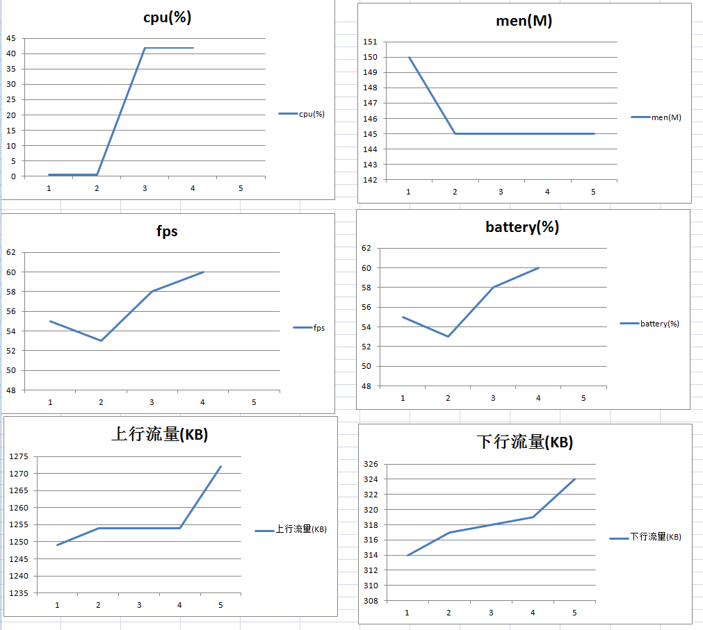
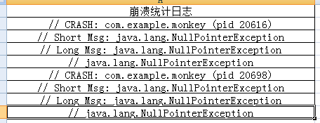

# -*- coding: utf-8 -*-
# monkey 压力测试android 
* python3 
* 统计性能信息cpu,men,fps,battery,flow
* 支持wifi,gprs统计
* 统计crash信息
* 支持多安卓设备
 


## monkey.ini 配置文件

``` 

cmd=monkey -p com.opera.olist --throttle 500 --ignore-timeouts --ignore-crashes   --monitor-native-crashes -v -v -v 500 >
package_name=com.opera.olist
activity = com.olist.main.ui.MainActivity
net = wifi  
```

- throttle 每次事件等待500毫秒
- net 支持gprs和wifi







